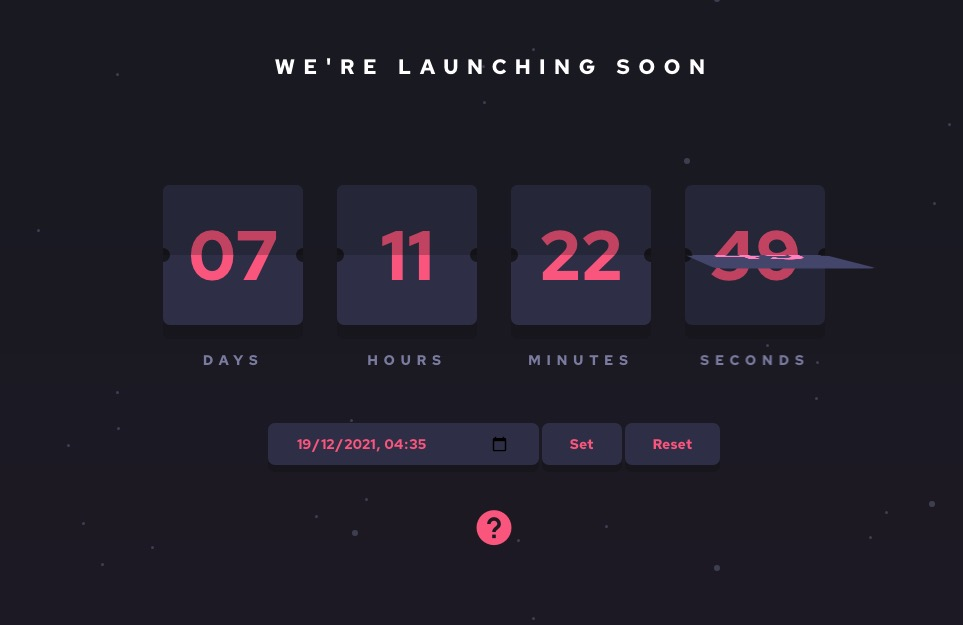

# Frontend Mentor - Launch countdown timer solution

This is a solution to the [Launch countdown timer challenge on Frontend Mentor](https://www.frontendmentor.io/challenges/launch-countdown-timer-N0XkGfyz-). Frontend Mentor challenges help you improve your coding skills by building realistic projects.

## Overview

### The challenge

Users should be able to:

- See hover states for all interactive elements on the page
- See a live countdown timer that ticks down every second (start the count at 14 days)
- **Bonus**: When a number changes, make the card flip from the middle

### Screenshot

### Links

- Solution URL: [Add solution URL here](https://your-solution-url.com)
- Live Site URL: [Add live site URL here](https://your-live-site-url.com)

## My process

### Built with

- Semantic HTML5 markup
- CSS custom properties
- Flexbox
- CSS Grid
- Modernizr

### What I learned

- I started to grapple with the time methods in Javascript.
- I deepened my knowledge of css animations.
- I used modernizr to detect a feature.

### Useful resources

- [Simple Javascript Countdown Tutorial](https://www.youtube.com/watch?v=Rib69h2DOxg) - by DevEd.
- [Build a Birthday Countdown in JavaScript (super simple!)](https://www.youtube.com/watch?v=V-Mcul5kS_Y) - by Ania Kubów.

## Author

- Frontend Mentor - [@Filippo-B](https://www.frontendmentor.io/profile/Filippo-B)
